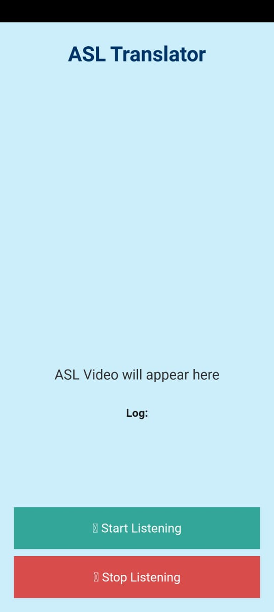
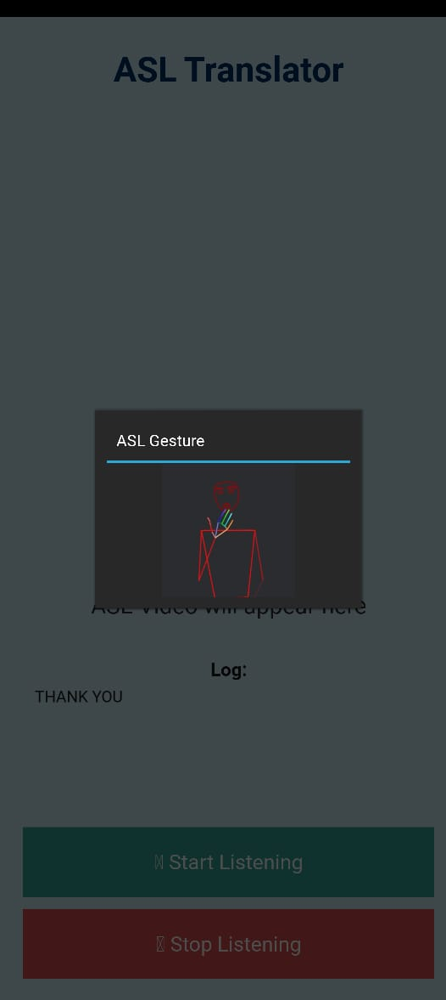

# SIGNSPEAK-AI 🤟🗣️  
**Speech-to-American Sign Language (ASL) Translation System with Gesture Animation**

SIGNSPEAK-AI is an intelligent system that listens to spoken English, translates it into American Sign Language (ASL) gloss, and plays corresponding gesture animations—bridging the communication gap between hearing and deaf individuals. The system combines deep learning, NLP, and gesture visualization to deliver real-time, word-level sign language translation via a mobile-friendly application.

Still in Development!!!

---

## 🔍 Features

- 🎤 **Speech Recognition** using [Vosk](https://github.com/alphacep/vosk-api)
- 🤖 **English to ASL Gloss Translation** using a fine-tuned [T5 Transformer](https://huggingface.co/docs/transformers/model_doc/t5)
- 🎞️ **Gesture Playback** using local ASL animation videos
- 📱 **Kivy-based Android App** that works offline (except model inference if hosted on a server)
- 🌐 **Flask-based backend API** for real-time model inference (optional)

---

## 📦 Project Structure

```
SIGNSPEAK-AI/
│
├── Mobile App/                     # Kivy Android app
│   ├── main.py                     # Kivy UI logic
│   ├── screens/                    # Onboarding and main UI
│   ├── videos/                     # ASL gesture videos
│   └── assets/                     # Images, icons, etc.
│
├── Mobile App Server/             # Flask backend (optional)
│   ├── app.py                      # Flask app
│   ├── model.py                    # T5 gloss translation logic
│   ├── utils/                      # Helper modules
│   └── asl_gloss500_t5/           # Trained T5 model (excluded in repo)
│       └── model.safetensors      # ⚠️ Not uploaded due to GitHub file size limit
│
├── requirements.txt               # Python dependencies
├── .gitignore
└── README.md                      # You're here!
```

---

## 🛠️ Setup Instructions

### ✅ Python Environment (Both App & Server)

```bash
# Create environment (optional but recommended)
python -m venv venv
source venv/bin/activate  # or venv\Scripts\activate on Windows

# Install dependencies
pip install -r requirements.txt
```

---

### 🧠 Download T5 Model

> ⚠️ GitHub does not allow files >100MB. Download the `model.safetensors` separately:

1. [📥 Download model from Google Drive]([https://drive.google.com/your-model-link](https://drive.google.com/file/d/1cOjtZJYjlc2pQMVYVueTjK99NLds4VTx/view?usp=sharing))
2. Place it under:  
   `Mobile App Server/asl_gloss500_t5/model.safetensors`

---


### 📱 Build Android App (using Buildozer)

```bash
cd "Mobile App"
buildozer init
buildozer -v android debug
# APK will be in bin/
```

---

## 🚀 How It Works

1. **User speaks a sentence**
2. App captures audio and converts it to text using Vosk
3. Text is sent to Flask server (or handled locally) and translated to ASL gloss
4. The app matches gloss words with local gesture videos
5. Videos are played in sequence for visual sign output

---

## 🎓 Tech Stack

- Python 3.10
- Vosk (offline speech-to-text)
- Hugging Face Transformers (T5 model)
- Flask (API server)
- Kivy (Android UI framework)
- OpenCV (video playback)
- Git LFS (optional, for model)

---

## 📱 Screenshots

| Onboarding | ASL Translation |
|-----------|----------------|
|  |  |

---

## 🤝 Contributors

- **Lokesh [@Lokeshcreator01](https://github.com/Lokeshcreator01)** — App & Server Development, Model Integration
- Special thanks to open-source contributors for Vosk, HuggingFace, and Kivy.

---

## 📜 License

This project is licensed under the **MIT License** — feel free to use, modify, and share.

---

## 📝 Citation (if used for research)

```
@project{signspeak2025,
  author = {Lokesh},
  title = {SIGNSPEAK-AI: A Speech-to-ASL Translation System with Gesture Animation},
  year = {2025},
  note = {GitHub repository: https://github.com/Lokeshcreator01/SIGNSPEAK-AI}
}
```

---

## 📬 Feedback or Issues?

Feel free to open a [GitHub Issue](https://github.com/Lokeshcreator01/SIGNSPEAK-AI/issues) or reach out directly for questions, improvements, or collaboration!

---
